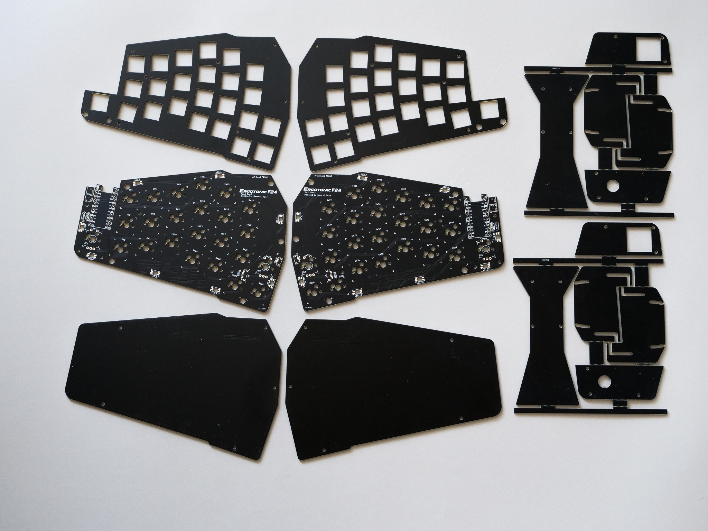

[<<Prev: Index](index.md) 

# 1. 準備

組み立てを始める前に、パーツおよびツールが揃っていることを確認します。

## キット添付品

|品名 (基本部)              | 数量 |備考|
|:-------------------------|----:|----|
|PCB (プリント基板)  右     | 1枚 |  |
|PCB (プリント基板)  左     | 1枚 |  |
|トッププレート             | 2枚 | 左右共通  |
|ボトムプレート             | 2枚 | 左右共通  |
|ジョイントパーツ           | 2枚 | 切り離して利用|
|ネジ(短)                  | 32本 | M2 3mm  |
|ネジ(長)                  | 16個  | M2 5mm   |
|スペーサー(短)             | 12個 | M2 3.5mm   |
|スペーサー(長)             | 12個 |  M2 7mm  |
|基板用コネクタ4P           | 2個  |    |
|コネクタ付きコード4P       | 1個  |    |
|ダイオード                |48個  | 1N4148W  |
|TRRSジャック              |2個   |    |
|タクトスイッチ             |2個  |   |
|クッションゴム            |10個  |   |

## キット以外に用意するもの

|品名                   | 数量 |備考|
|:----------------------|----:|:---|
| ProMicro              | 2個| Type-C版も可|
| コンスルー             | 4個|  12ピン|
| MXスイッチソケット       |48個|  |
 キーキャップ (1Uサイズ)  | 48個| |
 TRRSケーブル (4極オーディオ) | 1本 | 30cm以上推奨 |
 アンダーグロー用LED SK6812MINI-E |16個|オプション|
| ロータリーエンコーダー| 最大4個| オプション|

- 上記に上げたパーツはショップ店頭や通販で入手できます。  [パーツショップ(日本)](08_reference.md)に記した通販サイトからの購入が便利です。

- オプションと表記しているパーツは無くてもキーボードとしての基本機能は満たします。お好みに応じて準備して下さい。

- ロータリーエンコーダーは特定のキースイッチと排他で最大4個搭載できます。Alps EC12 またはEC11シリーズ互換のものを準備下さい。
日本国内で簡単に手に入るものとしては下記で動作確認しています。
   - [遊舎工房(ロータリーエンコーダ)](https://shop.yushakobo.jp/products/3762?_pos=1&_sid=5d7e3f999&_ss=r)
   - [秋月電子通商 【P-06357】ロータリーエンコーダ](https://akizukidenshi.com/catalog/g/gP-06357/)
    
   もし上記以外で動作を確認できた場合は作者にフィードバックいただけると幸いです。

## ツール
 - ハンダ道具一式
   - 糸ハンダ
   - はんだごて
   - フラックス
   - 周辺ツール(作業マット、コテ台、スポンジ、ハンダ吸い取り線、フラックス洗浄剤等)
 - ピンセット
 - 精密ドライバ(プラス No.0)
 - ラジオペンチ
 - カッターナイフ、定規、ヤスリ (PCB切り離し用) 
 - エポキシ系接着剤 (ProMicroの補強用。必要に応じて)
 - テスター  (可能なら必要に応じて)
 - 黒色のマジックペン (基板の側面の黒塗り用。必要に応じて)
  
----
[>>Next: ProMicroの準備](02_promicro.md)   

[Index](index.md)
