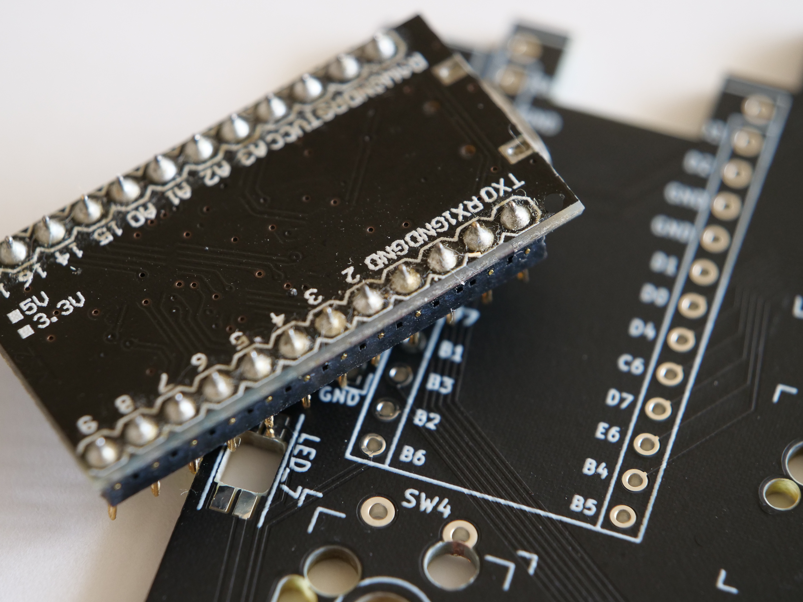

[<<Prev: 事前の準備](01_preparation.md)  

# 2. ProMicroの準備

## ProMicroにコンスルーをはんだ付けする

- スプリングピンヘッダの足の長い方をPCBのスルーホールへ差し込みます。
- ProMicroの部品が実装してある面が内側に隠れるような向き(平らな面が見える向き)でピンヘッダに差し込みます
- ProMicro側のピンヘッダをはんだ付けします。

  

NOTE
- PCB側のピンヘッダははんだ付けしません。はんだ付けするのはProMicro側だけです。
- ProMicroの表裏を間違えるとリカバリが非常に大変ですのではんだ付けの前に向きに注意ください。

TIPS:
 - [ProMicroへコンスルーの取り付け方(遊舎工房)](https://yushakobo.zendesk.com/hc/ja/articles/360044233974-%E3%82%B3%E3%83%B3%E3%82%B9%E3%83%AB%E3%83%BC-%E3%82%B9%E3%83%97%E3%83%AA%E3%83%B3%E3%82%B0%E3%83%94%E3%83%B3%E3%83%98%E3%83%83%E3%83%80-%E3%81%AE%E5%8F%96%E3%82%8A%E4%BB%98%E3%81%91%E6%96%B9%E3%82%92%E6%95%99%E3%81%88%E3%81%A6%E4%B8%8B%E3%81%95%E3%81%84)

## USBコネクタ周辺を補強する(オプション)

ProMicroはUSBコネクタ部分の強度が弱いことが知られています。
対策としてProMicroのUSBコネクタ部分をエポキシ系接着剤の樹脂で強化します。
 - エポキシ系接着剤の説明書の指示通りに調合し、爪楊枝の先などで慎重にUSBコネクタ周辺に盛り付けます。
 - 樹脂が硬化するまで安静にします。

TIPS:
  - [もげマイクロ対策(Google search)](https://www.google.com/search?client=firefox-b-d&q=%E3%82%82%E3%81%92%E3%83%9E%E3%82%A4%E3%82%AF%E3%83%AD)
  - 2液タイプのエポキシ系接着剤は100円ショップでも手に入ります。

----
 [>>Next: PCBへのパーツ取り付け](03_soldering_pcb.md)

 [Index](index.md)
