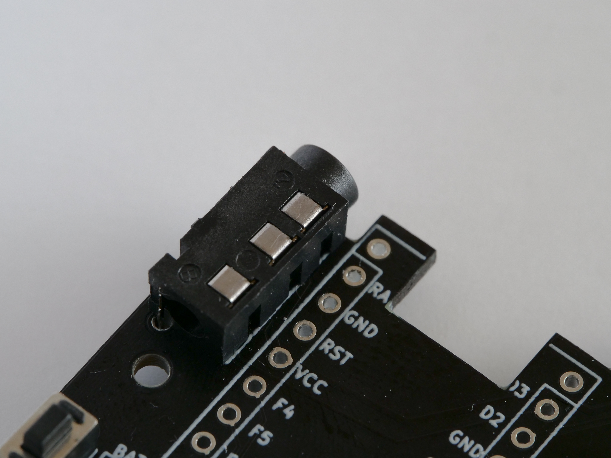
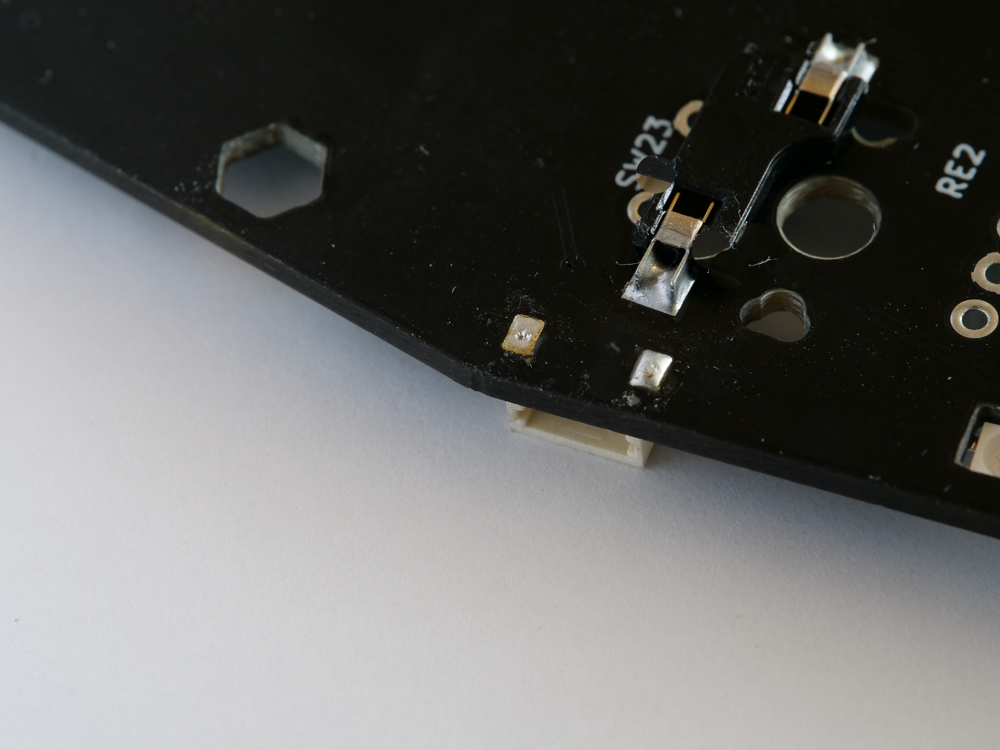

[<<Prev: ProMicroの準備](02_promicro.md)  

# 3. PCBへのパーツ取り付け

- PCBは、左側と右側で種類が分かれています。このページの操作は左右それぞれのPCBに対して作業を行ってくだい。

- PCBへのパーツを取り付ける際にはPCBの左右、表裏に注意して下さい。プリントされている表記で判断出来ます。

   

## ダイオードをはんだ付けする

電流の流れを制御するダイオードをはんだ付けします。

- ダイオードはPCBの裏面から取り付けます。
- ダイオードには極性があります。LEDに薄い線が印刷されている方向(カソード)をPCBシルクに合わせて配置します。
  
   

- 両端2ヶ所をはんだ付けします。

NOTE:

 - ダイオードの方向を間違わないよう気をつけて下さい。
 - キーが反応しないというトラブルの多くはダイオードのハンダ不良に起因します。はんだ付けの後に目視確認をしっかり行って下さい。
   - ハンダを忘れている部分がないか
   - はんだ付け不良の部分はないか
   - ダイオードの方向に間違いはないか
 
TIPS:

- SMD型ダイオードのはんだ付けのコツ
  - PCBのパッドの片方に予備ハンダを盛ります
  - 予備ハンダを溶かしつつピンセットでダイオードを所定の位置に送ります
  - 反対側をはんだ付けします
  - 予備ハンダをした方をもう一度はんだ付けします

## アンダーグローLEDをはんだ付けする(オプション)

キーボードの下を装飾するアンダーグローLEDをはんだ付けします。

- PCBの裏面のLED_0、LED_1、LED_2とシルク印刷されている箇所に取り付けます。
  - PCBの表側から、光る面が裏側(下向き)になるように配置します。
  - LEDには極性があります。LEDの足が欠けている方向をシルクの印に合わせます。
  
  

-  LEDの4ヶ所の足をはんだ付けします。

NOTE:

 - LEDの表裏、方向を間違わないよう気をつけて下さい。
 - 一度はんだ付けした後だと取り付け方向を修正するのは非常に困難になります。
  はんだ付けの前にしっかりと取り付け方向が正しいことを確認するようにして下さい。
 - RGB LEDは熱に弱いため、高温で長時間はんだ作業をしないよう注意して下さい。
 - LEDは番号の順に数珠つなぎで接続されています。光らない場合は番号順に調べていくようにしてください。

トラブルシュート:
  - [LEDが点灯しない](07_troubleshoot.md)

## スイッチソケットをはんだ付けする

キースイッチを取り外し可能にするソケットをはんだ付けします。

- PCBの裏面からシルクに合わせて取り付けて、2ヶ所をはんだ付けします。
  
  

## リセットスイッチをはんだ付けする

- PCBの表側からタクトスイッチを取り付けます(極性はありません)
- PCBの裏側からはんだ付けします
  
  

## TRRSジャックをはんだ付けする

- PCBの表側からタTRRSジャックを取り付けます。
- PCBの裏側からはんだ付けします
  
  

## 基板用コネクタをはんだ付けする

- 左右のPCBをケーブルで結ぶためのコネクタをはんだ付けします。
- 若干難易度が高いので注意しながら進めてください。

下記は、作者が行っている方法です。

- PCBの表側に部品の位置を合わせマスキングテープで仮止めします

- PCBのパッドとコネクタの足の位置をしっかり見定め、コネクタの足を一本だけはんだ付けします
  - 2本以上の足をはんだ付けしてしまうと位置のリカバリが難しくなるので注意
  - この状態でコネクタを動かすとパッドごと剥がれてしまうことがあるので無理に動かさないように注意
- PCBの裏側のスルーホールからハンダを流し込みます。
  - スルーホールを通って表側までハンダが到達しコネクタをしっかりと接着していることを確認してください。
   

- PCB表側からコネクタの足の残りをはんだ付けします
   

## ロータリーエンコーダーを取り付ける

- ロータリーエンコーダーはRE1, RE2, RE3, RE4のシルク表記がある箇所に取り付けることができます。
- PCBの表側からパーツを取り付け、裏側をはんだ付けします。

----
 [>>Next: 組立前の動作確認](04_operation_check.md)

[Index](index.md)
