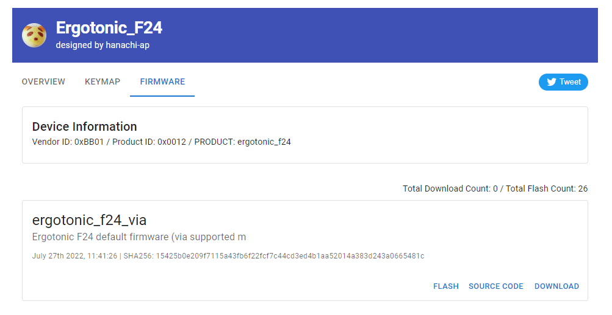
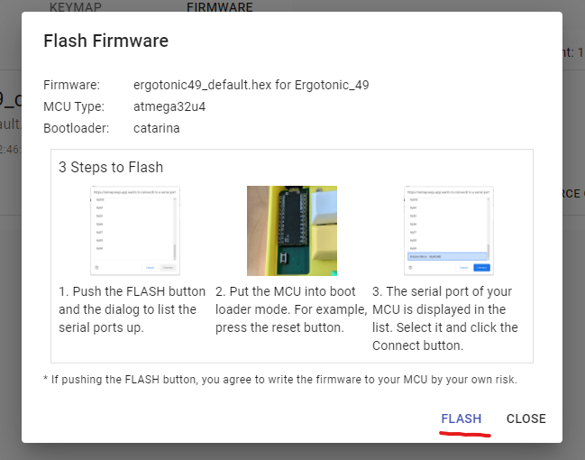
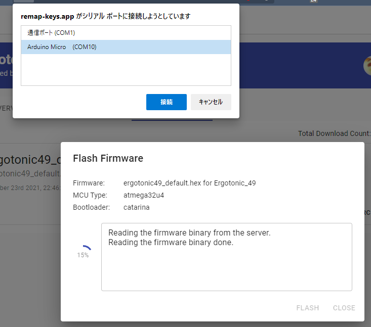
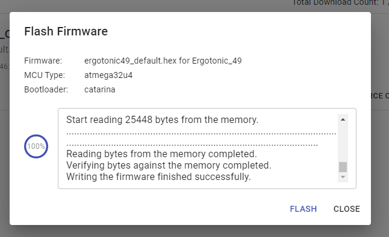
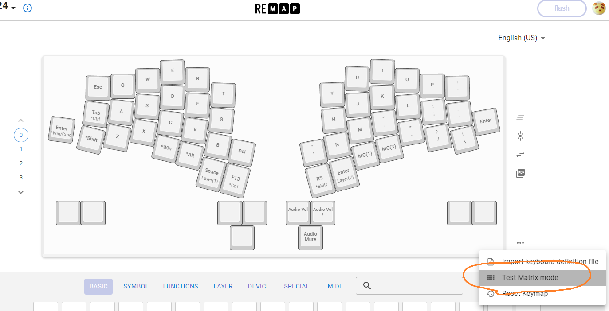

[<<Prev: PCBへのパーツ取り付け](03_soldering_pcb.md)  

# 4. 組立前の動作確認

## ProMicroを取り付ける

PCBの表側からProMicroを取り付けます。

## ファームウェアを書き込む
----
2022年7月24日の時点で、Remapの公式登録が未完了です。
こちらから[ファームウェアをダウンロード](../firmware/binary/hanachi_ap_ergotonic_f24_default.hex)
してQMK Toolboxで書き込みしてください。

[JSONファイルをダウンロード](../via/ergotonic_f24_via.json)していただければRemapやVIAは利用できます。

----

下記の操作を左右2つ分のProMicroに対して行います。この段階ではまだTRRSケーブルやコネクタ付きコードで左右を連結しない状態にしておいてください。

- PCBに取り付けたProMicroとパソコンをUSBケーブルで接続します。

- ChromeもしくはEdge ブラウザで次のURLへアクセスします。

   [https://remap-keys.app/catalog/XRdgiLWthCPiTAo1Nvac/firmwar](https://remap-keys.app/catalog/XRdgiLWthCPiTAo1Nvac/firmwar)

-  書き込みを行うファームウェア(ここでは ergotonic_f24_default.hex )の FLUSH 
   をクリックし、表示される操作方法(英語表記です)を確認し、さらにFLUSHを
   クリックします。
  
   

   

- シリアルポート選択のポップアップ画面が出たら、キーボードのリセットボタンを
  押します。

- シリアルポートの一覧に ’Arduino Micro (COMxx)' とう行が追加されるので
  それを選択して ’接続’ をクリックします。
   
   

- Firmware書き込みが正常に完了することを確認します。

   

TIPS:

- REMAPの画面や操作方法は日々更新されるため、実際の操作はREMAPに記載の
内容をよく確認の上で行うようにしてください。

- QMK Toolboxを利用する場合はファームウェアは下記から取得してください。
   [ergotonic_f24_default.hex](lib/ergotonic_f24_default.hex)  

## 左右をケーブルで結んで確認

- パソコンとProMicroのケーブルを取り外します。
- TRRSケーブルで左右のPCBを接続します。
- 左側のPCBにUSBケーブルを接続します

NOTE:
 通常の利用時も、USBケーブルは左側に接続します。

## キーが反応することを確認する

全体を組み立てる前にはんだ付けに問題がないかをこの時点で確認します。

Chromeブラウザで[REMAPサイト](https://remap-keys.app/configure)を開きます。

- Ergotonic_F24 という名称で認識され、キーマップ定義画面が開きます。
- 画面右側の  '...' メニューから "Test Matrix mode"に移ります。
- PCBにはんだ付けしたソケットにピンセットの先を差し込んでキーが押された状態を再現します。
- 画面上でキーが押された状態になったことを確認します

  

トラブルシュート:
  - [キーが反応しない](07_troubleshoot.md)

----
 [>>Next: 組み立て](05_assembly.md)

[Index](index.md)
