[<<Prev: 組立前の動作確認](04_operation_check.md)  

# 5. 組み立て

この章では、左右分離型として組み立てる手順を示します。

## ジョイントパーツを切り離す
- ジョイントプレートのパーツを切り離して端面をヤスリがけしてなめらかにします。
  
  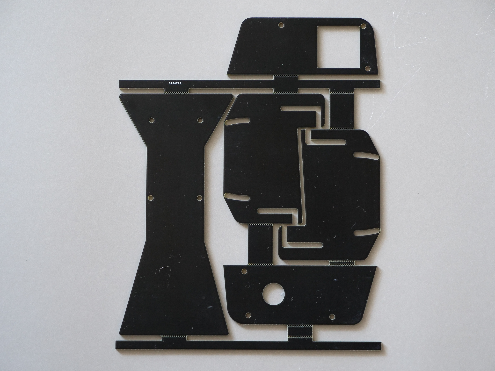

## PCBとトッププレートを結合する

- PCBにスペーサー(短)を2ヶ所ネジ止めします
  - 写真の位置に、表側にスペーサーを配置し裏側からネジ(短)でねじ止めします。
   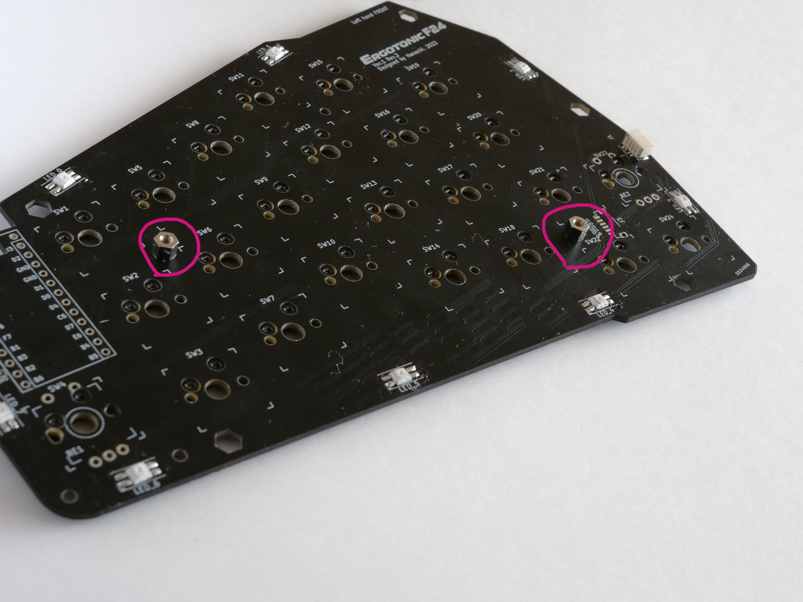
  
  - トッププレートを重ね、表側からも2ヶ所ネジ(短)でねじ止めします。
  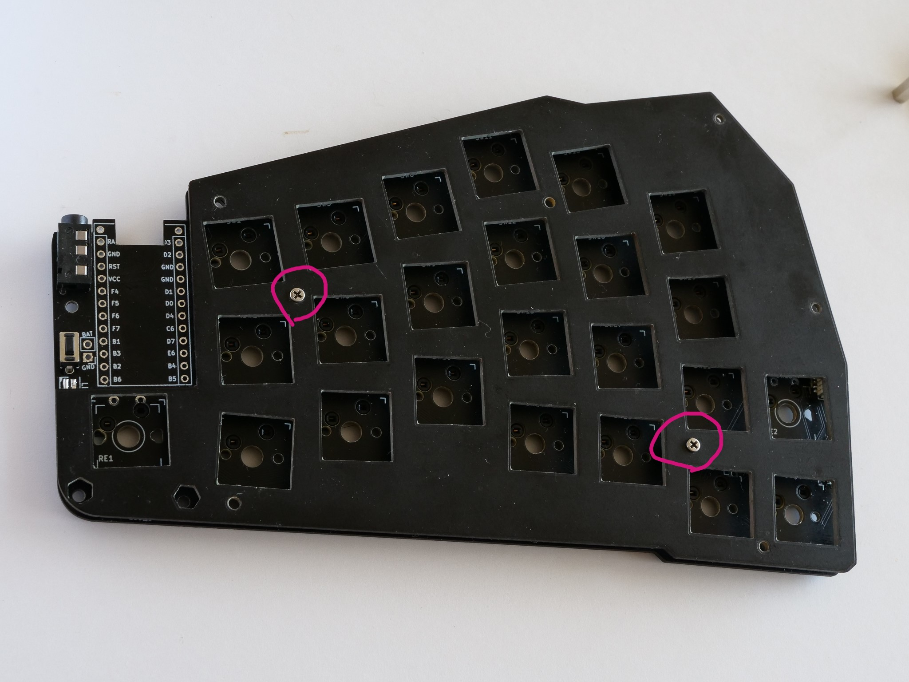

## ボトムプレートを結合する

- 全体を裏返し、PCBの6角形の穴の部分(5ヶ所)にスペーサー(長)を差し込みます
   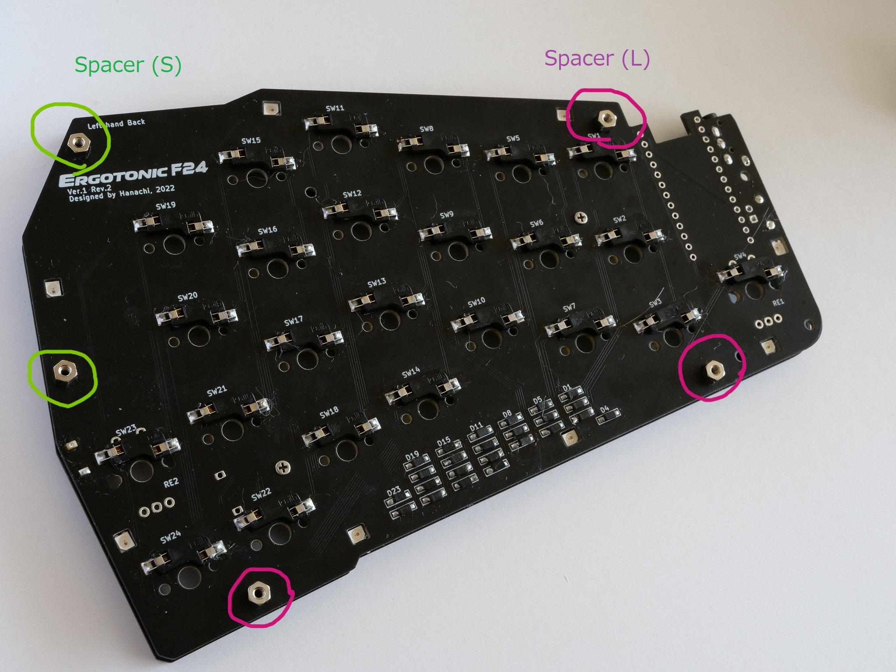
   
- トッププレート側からネジ(短)でネジ止めします
  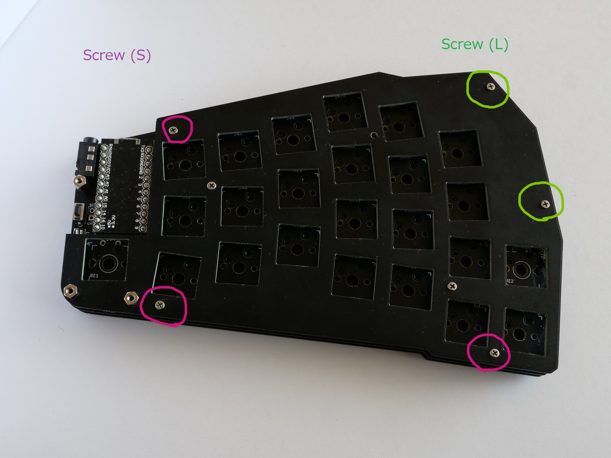
- ボトムプレートを重ね8ヶ所ネジ止めします
  
  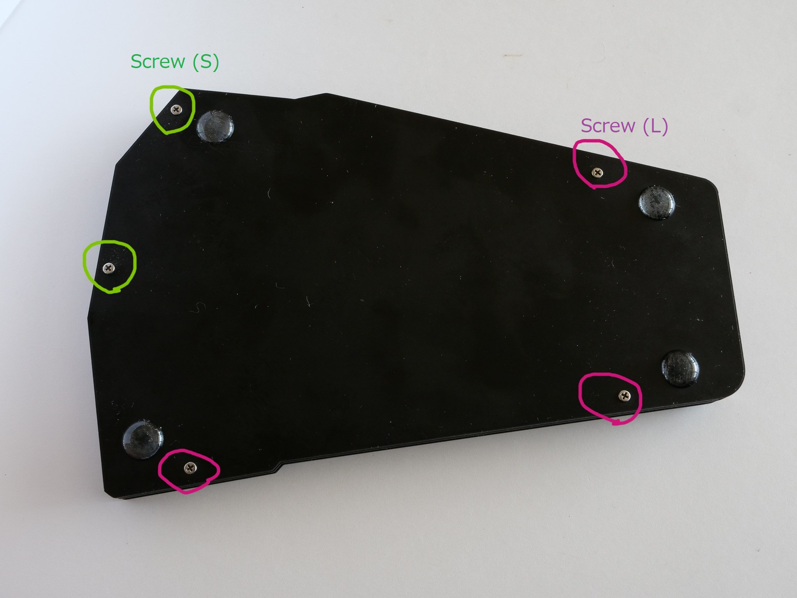

## PCBと保護プレートを結合する

- トッププレートの表側から、写真の位置にスペーサー(長)を配置し、PCBの裏側からネジ止めします
  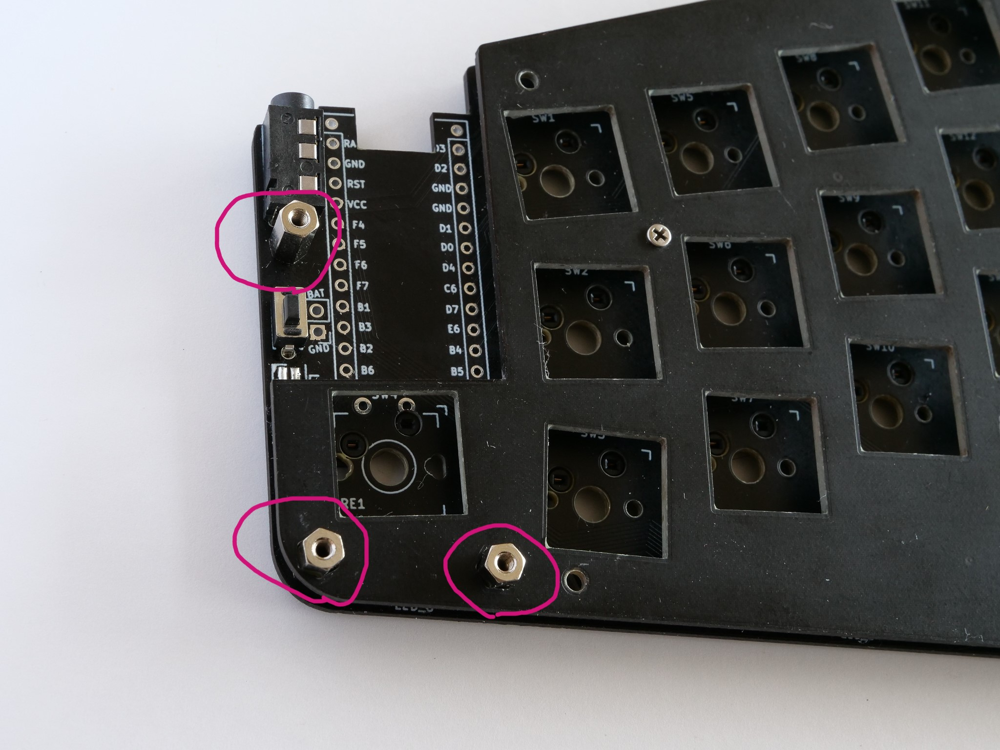
  
  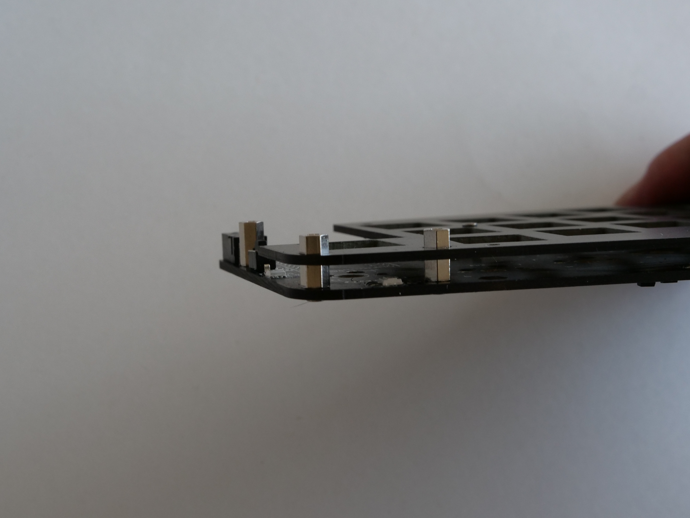 

- 保護プレートを重ねて上から3ヶ所ネジ止めします。
  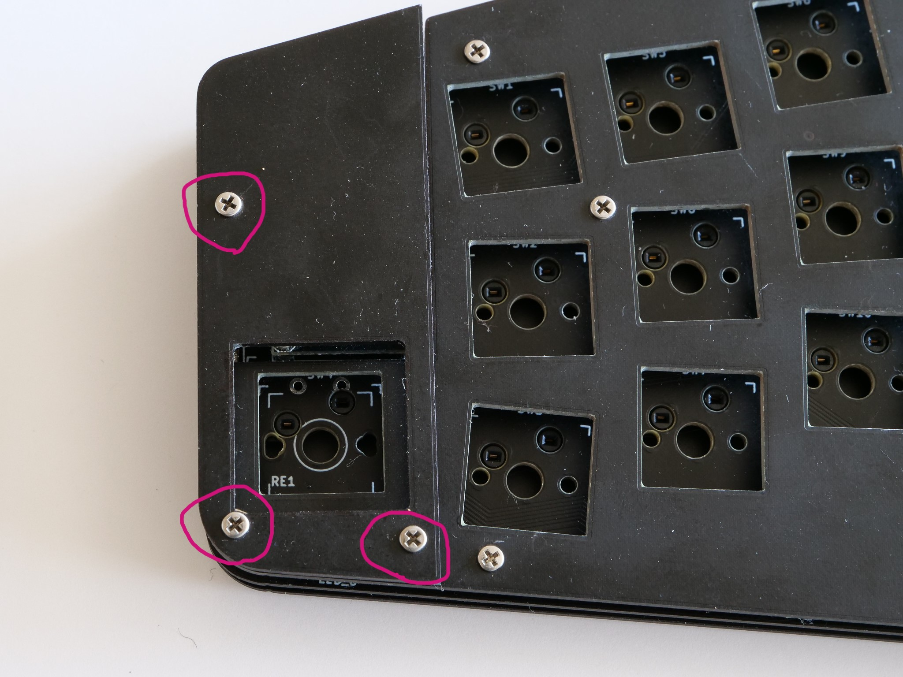

## ゴム足を取り付ける

- 裏側からゴム足を4箇所に取り付けます
  

# 合体! の方法

- 写真2箇所の部分のスペーサーを スペーサ(長)からスペーサー(短)に変更し、ネジも ネジ(短)の代わりにネジ(長)を使い軽く止めます。
  
  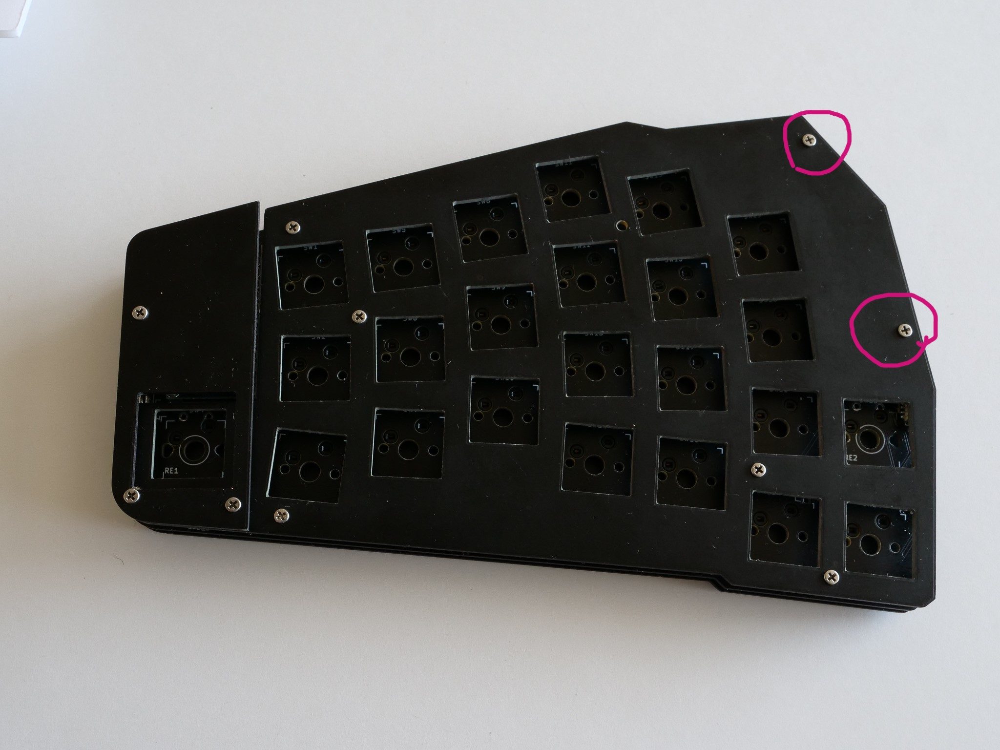

- 横から見ると写真のように スペーサー(短)が中央部に浮いている状態になります。
  
  

- ジョイントプレートも、スペーサー(短)とネジ(長)を使い、図のように組み立てます
  
  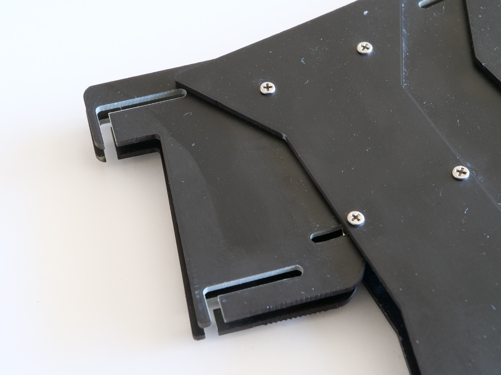

- ジョイントパーツのスリット部分を、先程のスペーサー(短)の隙間に通します。
  
  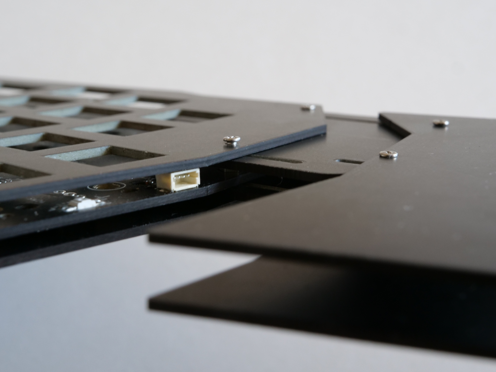

- コネクタ付きコード4Pをソケットに挿して左右を接続します。
  
  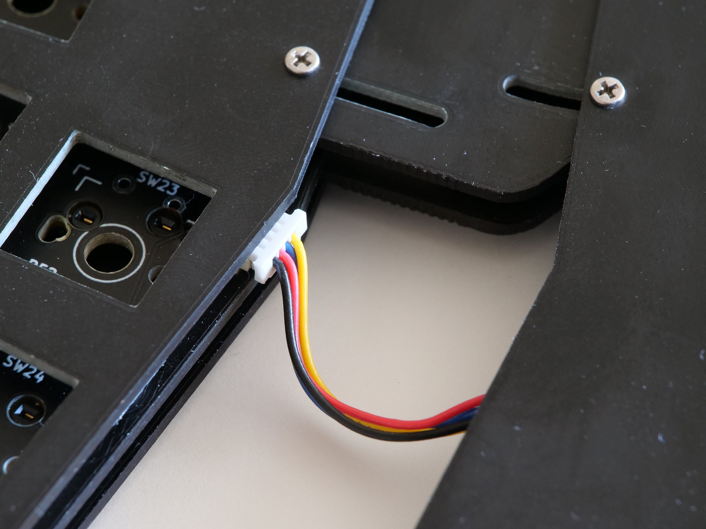

- ネジの締付けを調整しつつ好みの位置で固定します。
  
----
 [>>Next: 最後のステップ](06_final_step.md)

[Index](index.md)
