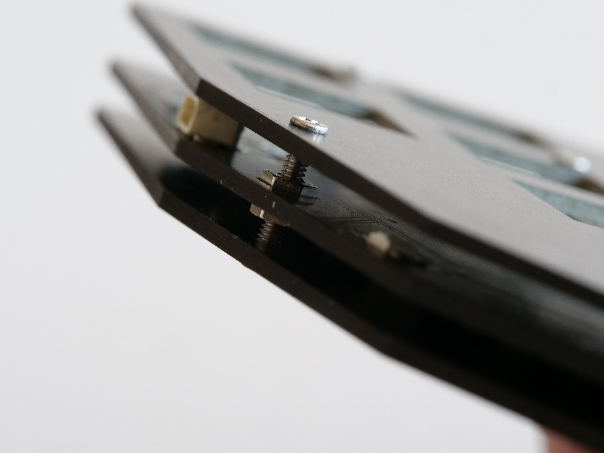

[<<Prev: 組立前の動作確認](04_operation_check.md)  

# 5. 組み立て

はんだ付けが終わったパーツをキーボードの形に組み上げていきます。

## ジョイントパーツを切り離す
- ジョイントプレートのパーツを切り離して端面をヤスリがけしてなめらかにします。
  
  

## TIPS: 基板の側面を黒く塗る
- 基板の側面を表面と同じ黒色で塗装すると、組み立てた後にぐっと締まった佇まいとなります。オプション作業ですが、黒のマジックペンで基板側面を黒く塗ることをおすすめします
  

## PCBとトッププレートを結合する

- PCBにスペーサー(短)を2ヶ所ネジ止めします
  - 写真の位置に、表側にスペーサー(短)を配置し裏側からネジ(短)でねじ止めします。
   
  
  - トッププレートを重ね、表側からも2ヶ所ネジ(短)でねじ止めします。
  

## スペーサー を取り付ける

- 全体を裏返し、PCBの六角形の穴の部分 Spacer(L)の指示の3ヶ所にスペーサー(長)を差し込みます
- PCBの六角形の穴の部分 Spacer(S)の指示の2箇所にスペーサー(短)を差し込みます。
  
   
   
- トッププレート側からネジ止めします

  - Scew(S)の指示部分には、ネジ(短)を使用します
  - Screw(L)の指示部分には、ネジ(長)を使用します

  

## PCBと保護プレートを結合する

- トッププレートの表側から、写真の位置にスペーサー(長)を配置し、PCBの裏側からネジ(短)で止めます
  
  
   

- 保護プレートを重ねて上から3ヶ所をネジ(短)で止めます。
  

## ボトムプレートを結合する

- ボトムプレートを重ね 5ヶ所をネジ止めします
  - Scew(S)の指示部分には、ネジ(短)を使用します
  - Screw(L)の指示部分には、ネジ(長)を使用します
  - 
  

- スペーサー(短)の部分に関しては、横から見ると写真のように スペーサー(短)が中央部に浮いている状態になります。
  
  

## [分離型で利用する場合]

### 三角スペーサージグを取り付ける
- プレートから切り出した三角形状のスペーサージグを2枚、プレートとスペーサー(短)の隙間に挟み込みネジを締めます。
  
  
  

## [一体型で利用する場合] 

### ジョイントプレートを結合する

- ジョイントプレートをスペーサー(短)とネジ(長)を使い、図のように組み立てます
  
  

- ジョイントパーツのスリット部分を、先程のスペーサー(短)の隙間に通します。
  
  

- コネクタ付きコード4Pをソケットに挿して左右を接続します。
  
  

- ネジの締付けを調整しつつ好みの位置で固定します。
  
## ゴム足を取り付ける

- 裏側からゴム足を左右それぞれ4箇所、ジョイント部分に2箇所に取り付けます
  

----
 [>>Next: 最後のステップ](06_final_step.md)

[Index](index.md)
