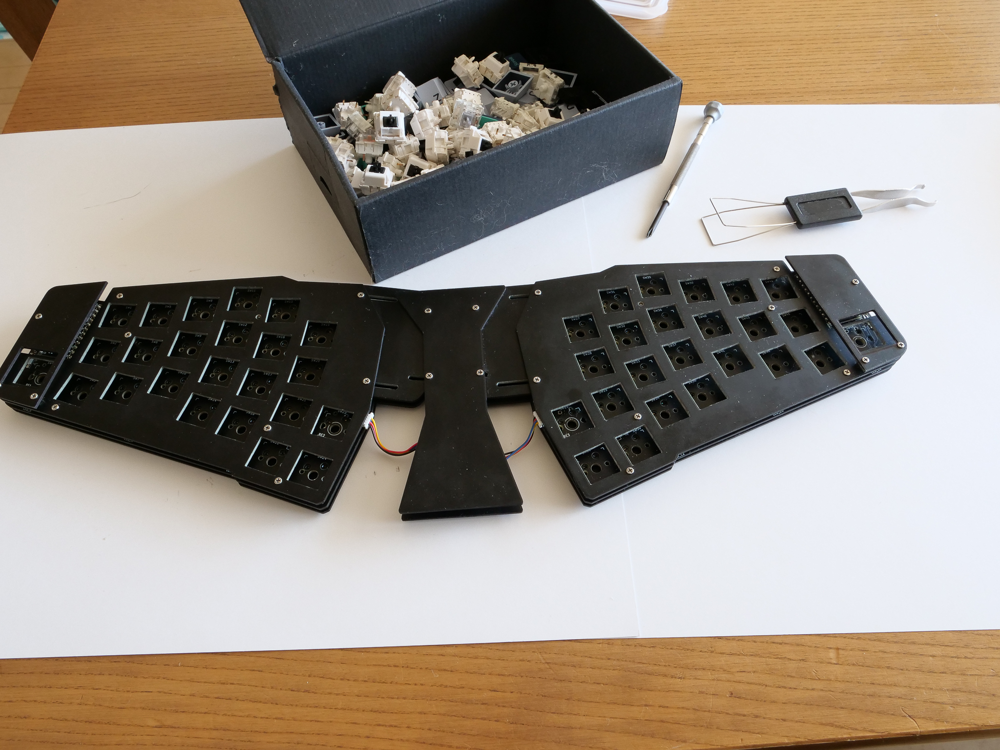

[<<Prev: 組み立て](05_assembly.md)  

# 6. 最後のステップ

## キースイッチを取り付ける

  

キースイッチをトッププレート側から取り付けます。

NOTE:

  - キースイッチを取り付ける際にはまっすぐ上から慎重に差し込むようにします。
  - スイッチのピンは曲がりやすいので注意してください。 ピンが曲がったまま無理矢理取り付けるとそのキーは反応しなくなります。
  - ピンが曲がってしまった場合でも、一度引き抜いてラジオペンチの先端で慎重に伸ばせばリカバリ可能です。

## キーキャップを取り付ける

お好きなキーキャップ取り付けます。

## 最終動作確認

最後の確認を行って完成です。
- すべてのキーが反応すること
- すべてのLEDが点灯すること

うまく行かないことがある場合は → [トラブルシュート](07_troubleshoot.md)

## 問題がなければこれで作業は完了です!

素敵な写真を撮ってSNSで自慢しましょう。

----
 [>>Next: トラブルシュート](07_troubleshoot.md)

[Index](index.md)
