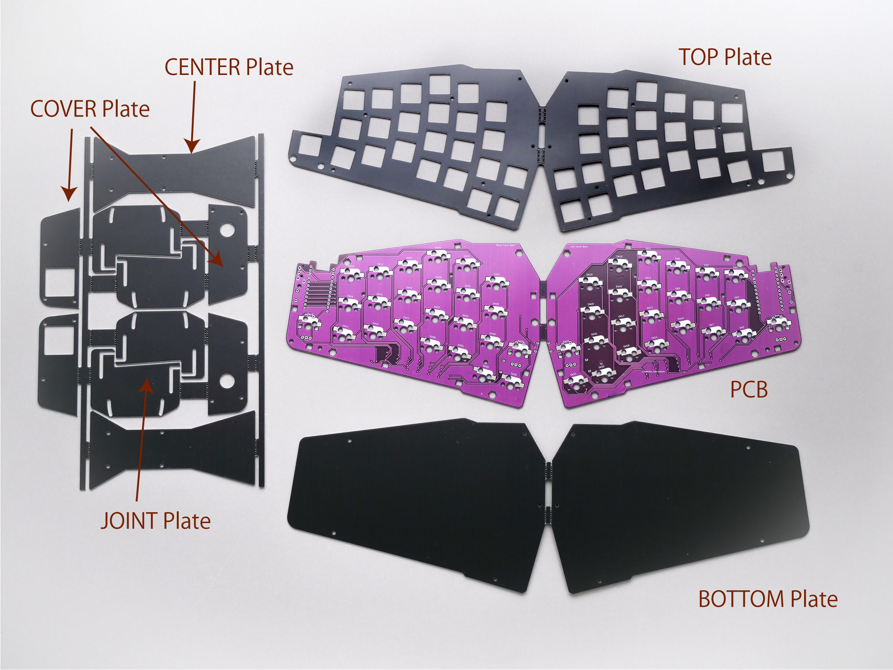
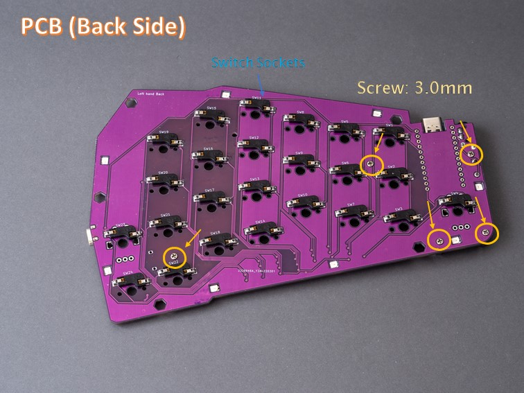
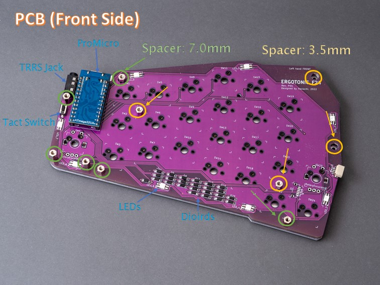
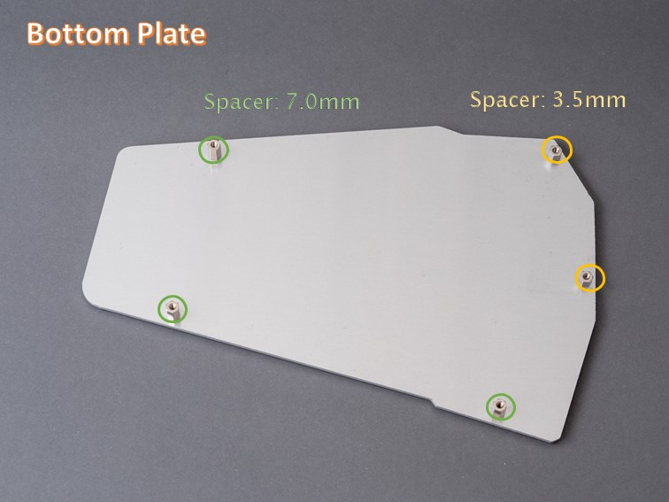
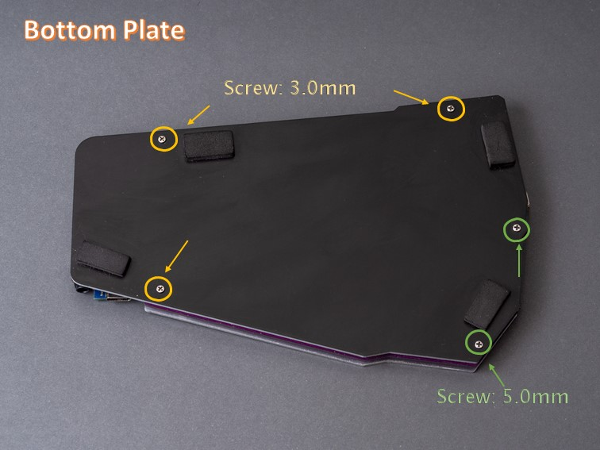
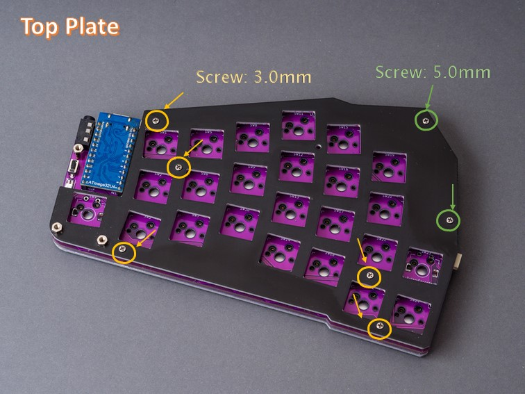
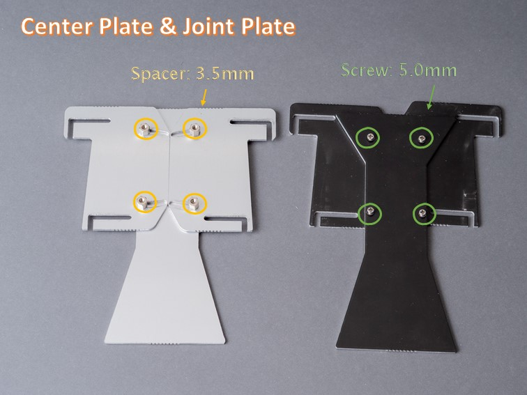
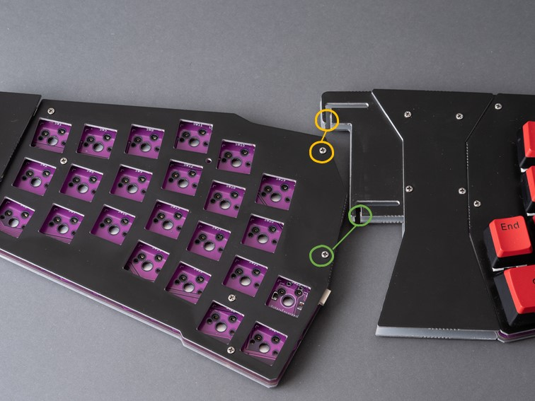
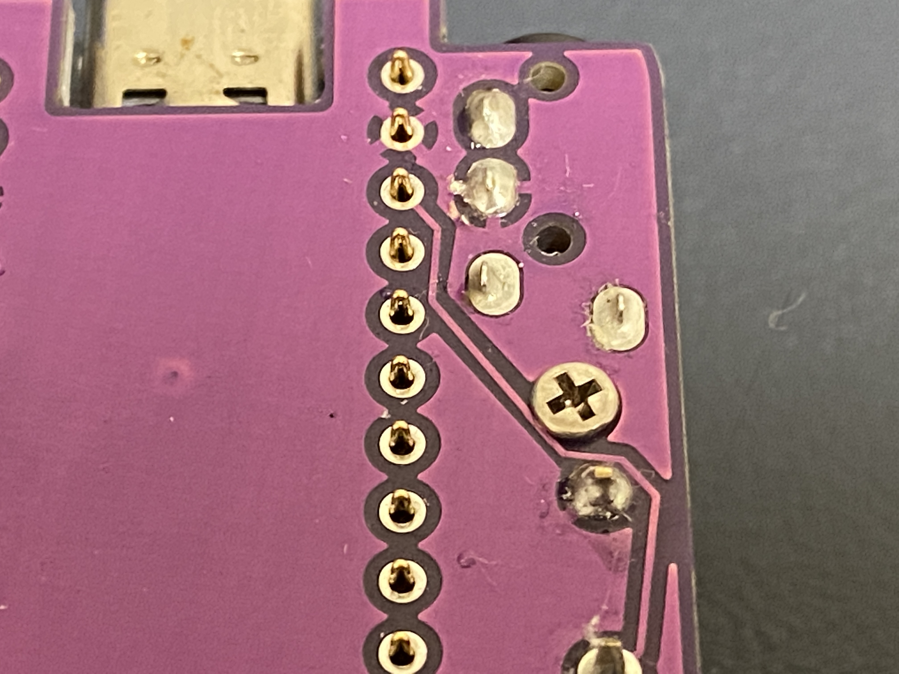

# Ergotonic F-24 ドキュメント

Erogotonic F-24は開発段階での仮称です。

## ビルドガイド(暫定版)

### 組み立て手順概要
0. 部品を揃える
1. パーツを分離する
2. はんだ付け
3. 組み立て

## 部品そ揃える

### 必須パーツ
- ProMicro + コンスルー (2)
- ダイオード SMD (48)
- MXソケット   (48)
- タクトスイッチ 2pin (2)
- TRRSソケット(2)
- LED SK6812MINI-E  (16)
- M2 3.0mm ネジ (40)
- M2 5.0mm ネジ (16)
- M2 3.5mm スペーサー (12) ※1
- M2x7.0mm スペーサー (16) ※1
- MXスイッチ(48)
- キーキャップ  (1U 48)
- TRRSケーブル もしくは TRSケーブル (1)

※1 スペーサーは 廣杉計器 ASB-2007E、ASB-2003.5E を想定した設計となっています

### オプション1 
 - ロータリーエンコーダ Alps EC12シリーズ互換 (最大4)

  2022年3月17日現在、ロータリーエンコーダーの動作確認とファームウェアできてません。近々やります。

### オプション2 (TRRSケーブルを用いずにワイヤで左右を繋ぐ場合)
  - HZコネクタ 4pin (2)
  - HZ端子(2) 
  - ワイヤ 約15cm (4)  端子圧着

※ 作者は、GALAPAGOSに一緒に頒布されたコネクタとケーブルを使用して確認しています

## 1．パーツを分離
  
- 各パーツを分離してバリ取りしてください。

   - アルミ素材の部品もあるので金属用ヤスリがあると良いです

## 2．はんだ付け

### 表面に取り付けるもの
  - ProMicro
  - ダイオード
  - RGB LED
  - TRRSコネクタ
  - リセット用スイッチ

### 裏面に取り付けるもの
  - スイッチソケット

## 3． 組み立て

基本的には Ergotonic49と同じような感じで組み立てます。

- トッププレートとPCBを、M2 3.5mm スペーサー 2個を使って合体する。

- PCBとカバープレートを、M2 7mmスペーサー3個を使って合体する。

- それとボトムプレートを、M2 7mmスペーサー 3個を使って合体する。

  - その時、内側 2箇所にM2 3.5mmスペーサーを埋め込んで上下から軽くM2 3.5mmネジで止めておく

- 上記を左右について実施する

- 中央プレートとジョイントプレートをM2 3.5mmスペーサーを使って仮組みする

- 本体とジョイントプレートを結合してネジ止めする

下記の写真を参考にして下さい

  

  

  

  

  

  

# Known issues

## 【重要】 ロータリーエンコーダの実装制限について

ロータリーエンコーダを取り付けた場合、ロータリーエンコーダの金属筐体とアルミプレートを経由して、
予期せぬ電流の漏洩と回路のショートを引き起こす可能性があることがわかりました。
ショートした場合ProMicroの動作が停止しキー入力が行えなくなリます。

原因としてはロータリエンコーダとMXソケットを同居させるためのフットプリント設計の問題と、
アルミプレートを実装に利用したことが重なって発生しています。
これまでも同様のフットプリントを利用してきましたが今回アルミ素材を使用することで潜在的な問題が明るみに
出た形となりました。

この問題を回避するためンコーダー周囲から電流がもれないようにするようテープなどで保護することを試みましたが
結果としてはうまくいきませんでした。

そのため Rev.P01においてはロータリーエンコーダーの取り付け機能自体を制限事項とさせていただきたくご了承下さい。

## 【重要】電流漏洩の対策について
リセットスイッチ近くに取り付けるネジですが、強く締めすぎると基板のレジストを削ってしまいパターンがショートしてしまうことがあります。締め付けすぎに注意下さい。もしショートするほど削れてしまった場合樹脂製のワッシャーかカプトンテープで絶縁して下さい。

## その他の既知の問題点
- 左手側のProMicroの位置がトッププレートと干渉するかしないかの本当のギリギリ。次はもう少しクリアランスを取りたい
- 左右をTRRSに代えて直結するためのソケット J2,J5の位置はもう少し奥まった所にしたい
- J2, J5のピン配置が、対面でストレートとなる様になっている。GALAPAGOSで一緒に送ってもらったケーブルはクロス配線なのでそのままでは使えない。
- 拡張用ソケット J3のフットプリントが逆向き
- J3, J6は未テスト。というか拡張基盤は未実装
- アルミ素材プレートの切り離し用のマウスバイトのホールが設計より大きくなったため、バリを削っても少し凸凹してしまう(製造が始まってから、アルミの場合0.6mmホールはNGなのでで1.0mmにするよと言われてしまった)

- 親指側に取り付けるロータリーエンコーダーのプッシュ操作に対する反応するファームウェアが未実装

以上
